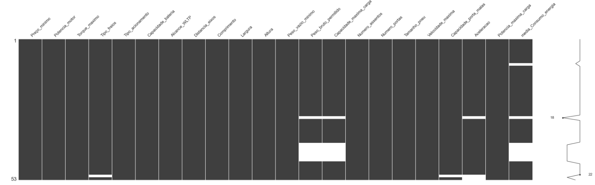
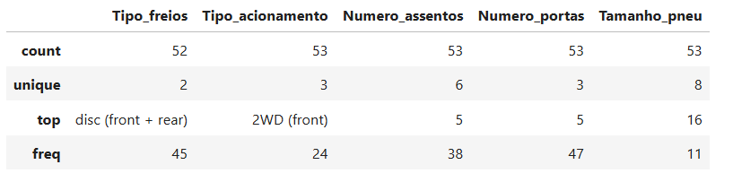
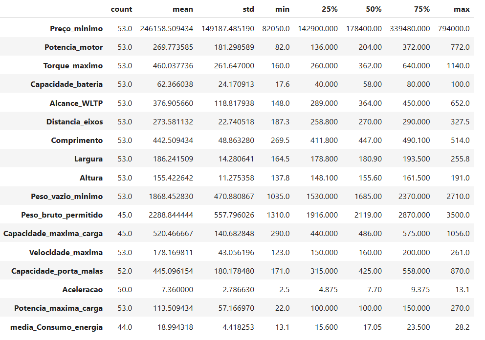

# Prevendo_Consumo_Energia_Carros_Eletricos

## <font color='blue'>**Machine Learning em Logística**</font>

 ### **1. Introdução**

Uma empresa do setor de transporte e logística está buscando formas de otimizar seus custos operacionais. Uma das iniciativas consideradas é a migração da sua frota de veículos para carros elétricos.
<br>
<br>
---
 ### **2. Objetivo**

  Desenvolver um Modelo de Machine Learning para **Prever o Consumo de Energia de Carros Elétricos.**
<br>
<br>
---
 ### **3. Organização do Projeto**

```
1. Introdução
2. Objetivo
3. Organização do Projeto
4. Descrição dos Dados
    4.1 Conjunto de dados
    4.2 Dicionário de dados 
    4.3 Bibliotecas  
    4.4 Análise Exploratória de Dados
5. Identificação e Tratamento dos Dados              
6. Análise Univariada 
7. Análise de Correlação
8. Desenvolvimento do Projeto
    9.1 Pré Processamento dos Dados      
9. Conclusão do Projeto
10. Referências Bibliográficas 
```
<br>

---

 ### **4. Descrição de Dados**
 ### ```4.1 Conjunto de Dados ``` 

Este conjunto de dados [carros_eletricos](https://data.mendeley.com/datasets/tb9yrptydn/2) contém informações sobre carros de passeio totalmente elétricos disponíveis para compra na Polônia a partir de 2 de dezembro de 2020. Inclui 53 modelos de carros elétricos (incluindo diferentes variantes) e 22 variáveis, como tipo e número de motores elétricos, peso do veículo, capacidade de carga e eficiência da bateria. Os dados foram obtidos de materiais oficiais dos fabricantes e complementados com informações do [SAMAR AutoCatalog](https://data.mendeley.com/datasets/tb9yrptydn/2/files/5d72814a-fb5f-42a2-8aed-7192a5008126) quando necessário. O objetivo deste conjunto de dados é fornecer informações detalhadas sobre os carros elétricos disponíveis no mercado para auxiliar na tomada de decisão de compra.
<br>
<br>
<br>
### ```4.2 Dicionário de Dados ```

#### **As colunas desse dataset são:**

*  **Car full name:**  Nome completo do carro.
*  **Make:**  Marca do carro.
*  **Model:**  Modelo do carro.
*  **Minimal price (gross):**  Preço mínimo bruto (82.050,00 a 794.000,00).
*  **Engine power:**  Potência do Motor (82 a 772 Km).
*  **Maximum torque:**  Torque Máximo (160 a 1140 Nm).
*  **Type of brakes:**  Tipo de Freios (0= disc front + rear,	1= disc front + drum rear).
*  **Drive type:**  Tipo de acionamento (1= 4WD, 2= 2WD (rear), 3= 2WD (front)).
*  **Battery capacity:**  Capacidade da bateria (17,6 a 100 KWh).
*  **Range (WLTP):**  Alcance WLTP (148 a 65 Km).
*  **Wheelbase:**  Distância entre eixos (187,3 a 327,5 cm).
*  **Length:**  Comprimento do carro.
*  **Width:**  Largura do carro (164,5 a 255,8 cm).
*  **Height:**  Altura do carro (137,8 a 191 cm).
*  **Minimal empty weight:**  Peso vazio mínimo (1035 a 2710 kg).
*  **Permissable gross weight:**  Peso bruto permitido (1310 a 3500 kg).
*  **Maximum load capacity:**  Capacidade máxima de carga (290 a 1056 kg).
*  **Number of seat:**  Número de assentos (2= 2 assentos, 4= 4 assentos, 5= 5 assentos, 6= 6 assentos, 7= 7 assentos, 8= 8 assentos).
*  **Number of doors:**  Tamanho do pneu (14,15,16,17,18,19,20,21 in).
*  **Maximum speed:**  Velocidade máxima (123 a 261 kph).
*  **Boot capacity (VDA):**  Capacidade do porta-malas (171 a 870 | litros).
*  **Acceleration 0-100 kph:**  Aceleração 0-100kph (2,5 a 13,1 kphs).
*  **Maximum DC charging power:** Potência máxima de carga (22 a 270 KW).
*  **Mean-energy consumption:**  Média - Consumo de energia (13,1 a 28,2 KWh/100 km).
 
<br>
<br>

### ```4.3 Bibliotecas:``` O projeto será realizado na Linguagem Python

---


**Estatística:**

- pandas, numpy, seaborn, matplotlib.pyplot, missingno, summarytools


**Preprocessamento:**

- **from** sklearn.preprocessing **import** OneHotEncoder, StandardScaler
- **from** sklearn.compose **import** ColumnTransformer
- **from** sklearn.impute **import** SimpleImputer
- **from** sklearn.preprocessing **import** LabelEncoder
- **from** sklearn.pipeline **import** Pipeline

**Modelagem e Avaliação:**

- **from** sklearn.model_selection **import** cross_val_score, train_test_split
- **from** sklearn.linear_model **import** Ridge, Lasso, ElasticNet, LinearRegression
- **from** sklearn.tree **import** DecisionTreeRegressor
- **from** sklearn.ensemble **import** RandomForestRegressor, GradientBoostingRegressor
- **from** sklearn.svm **import** SVR
- **from** sklearn.neighbors **import** KNeighborsRegressor
- **from** sklearn.metrics **import** mean_squared_error, r2_score
- **from** sklearn.feature_selection **import** RFE
  
<br>
<br>

### ``` 4.4 Análise Exploratória de Dados```

---

A Análise Exploratória de Dados (AED), conhecida como Exploratory Data Analysis (EDA) em inglês, é uma abordagem para investigar dados, extraindo conhecimento por meio de estatísticas e visualizações.

Este resumo apresenta as características mais importantes do conjunto de dados, oferecendo uma visão geral para um README ou apresentação. Para uma imersão completa na análise, com todos os detalhes e a metodologia utilizada, consulte o script Python, disponível no material de apoio.
<br>
<br>


* **Coletar os Dados:** Utilizamos a função ```pd.read_excel()``` do pacote pandas para importar um conjunto de dados a partir de um arquivo Excel chamado ```basecars.xlsx```. O conjunto de dados é armazenado na variável ```carros_eletricos```.

* **Dimensão do Conjunto de Dados:** A função ```.shape``` mostra que o conjunto de dados tem 53 linhas e 25 colunas. 

* **Estrutura dos Dados:** A função ```.info()``` do Pandas, identifica quais variáveis são numéricas e quais são categóricas.
 * **As Variáveis ​​Numéricas:** Preço_minimo, Potencia_motor, Torque_maximo, Capacidade_bateria, Alcance_WLTP,
 Distancia_eixos, Comprimento,
 Largura, Altura, Peso_vazio_minimo,
 Peso_bruto_permitido, Capacidade_maxima_carga,
 Velocidade_maxima, Capacidade_porta_malas,
 Aceleracao, Potencia_maxima_carga,
 media_Consumo_energia.

* **Valores Ausentes:** Utilizamos a função ```.isnull().sum()``` para obter a contagem de valores nulos em cada coluna. No total, este conjunto de dados possui 30 valores ausentes, o que corresponde a ```56%``` de todo o conjunto de dados.
 
* **As Variáveis com dados faltantes:** Tipo_freios, Peso_bruto_permitido, Capacidade_maxima_carga, Capacidade_porta_malas, Aceleracao, media_consumo_energia. 

* **Resumo Estatístico das Variáveis Numéricas:** Utilizamos a função ```.describe().T``` para calcular estatísticas como média, desvio padrão, mínimo, máximo e quartis para as colunas numéricas (int64 e float64).

 * **As Variáveis ​Categóricas:** Tipo_freios,
 Tipo_acionamento, Numero_assentos, Numero_portas,
 Tamanho_pneu.
 
* **Resumo Estatístico das Variáveis Categóricas:** Utilizamos a função ```.describe(include='object')``` para obter estatísticas descritivas das colunas do tipo "object" ou "category" (string). Essa função nos permite verificar a distribuição de frequência e identificar a moda de cada variável categórica.
<br>
<br>
<br>

Gráfico-1, **"Visualização dos Dados Faltantes"**

<br>
<br>
<br>

Gráfico-2, **"Resumo Estatísticos das Variáveis Categóricas"** 
<br>
<br>


<br>
<br>
<br>

Gráfico-3, **"Resumo Estatísticos das Variáveis Numéricas"** 
<br>
<br>


<br>

* **Insight:** Observamos que, em algumas variáveis, a média é maior que a mediana e os valores mínimos e máximos estão muito distantes. Isso sugere que a distribuição pode ser assimétrica positiva, indicando a presença de valores extremos na parte superior que "puxam" a média para cima. Em outras palavras, as variáveis não seguem uma distribuição normal e possivelmente contêm outliers.
<br>
<br>
<br>
