## Prevendo_Consumo_Energia_Carros_Eletricos

## <font color='blue'>**Prevendo o Consumo de Energia de Carros Elétricos**</font>

 ### **1. Introdução**

Uma empresa do setor de transporte e logística está buscando formas de otimizar seus custos operacionais. Uma das iniciativas consideradas é a migração da sua frota de veículos para carros elétricos.
<br>
<br>


---
 ### **2. Objetivo**

  Desenvolver um Modelo de Machine Learning capaz de **Prever o Consumo de Energia de Carros Elétricos.**
<br>
<br>


---
 ### **3. Organização do Projeto**

```
1. Introdução
2. Objetivo
3. Organização do Projeto
4. Descrição dos Dados
    4.1 Conjunto de dados
    4.2 Dicionário de dados 
    4.3 Bibliotecas  
    4.4 Análise Exploratória de Dados
5. Identificação e Tratamento dos Dados              
6. Análise Univariada 
7. Análise de Correlação
8. Desenvolvimento do Projeto
    8.1 Pré Processamento dos Dados 
    8.2 Modelagem dos Dados     
9. Conclusão do Projeto
10. Referências Bibliográficas 
```
<br>

---

 ### **4. Descrição de Dados**
 ### ```4.1 Conjunto de Dados ``` 

Este conjunto de dados [carros_eletricos](https://data.mendeley.com/datasets/tb9yrptydn/2) contém informações sobre carros de passeio totalmente elétricos disponíveis para compra na Polônia a partir de 2 de dezembro de 2020. Inclui 53 modelos de carros elétricos (incluindo diferentes variantes) e 22 variáveis, como tipo e número de motores elétricos, peso do veículo, capacidade de carga e eficiência da bateria. Os dados foram obtidos de materiais oficiais dos fabricantes e complementados com informações do [SAMAR AutoCatalog](https://data.mendeley.com/datasets/tb9yrptydn/2/files/5d72814a-fb5f-42a2-8aed-7192a5008126) quando necessário. O objetivo deste conjunto de dados é fornecer informações detalhadas sobre os carros elétricos disponíveis no mercado para auxiliar na tomada de decisão de compra.
<br>
<br>
<br>


### ```4.2 Dicionário de Dados ```

#### **As colunas desse dataset são:**

*  **Car full name:**  Nome completo do carro.
*  **Make:**  Marca do carro.
*  **Model:**  Modelo do carro.
*  **Minimal price (gross):**  Preço mínimo bruto (82.050,00 a 794.000,00).
*  **Engine power:**  Potência do Motor (82 a 772 Km).
*  **Maximum torque:**  Torque Máximo (160 a 1140 Nm).
*  **Type of brakes:**  Tipo de Freios (0= disc front + rear,	1= disc front + drum rear).
*  **Drive type:**  Tipo de acionamento (1= 4WD, 2= 2WD (rear), 3= 2WD (front)).
*  **Battery capacity:**  Capacidade da bateria (17,6 a 100 KWh).
*  **Range (WLTP):**  Alcance WLTP (148 a 65 Km).
*  **Wheelbase:**  Distância entre eixos (187,3 a 327,5 cm).
*  **Length:**  Comprimento do carro.
*  **Width:**  Largura do carro (164,5 a 255,8 cm).
*  **Height:**  Altura do carro (137,8 a 191 cm).
*  **Minimal empty weight:**  Peso vazio mínimo (1035 a 2710 kg).
*  **Permissable gross weight:**  Peso bruto permitido (1310 a 3500 kg).
*  **Maximum load capacity:**  Capacidade máxima de carga (290 a 1056 kg).
*  **Number of seat:**  Número de assentos (2= 2 assentos, 4= 4 assentos, 5= 5 assentos, 6= 6 assentos, 7= 7 assentos, 8= 8 assentos).
*  **Number of doors:**  Tamanho do pneu (14,15,16,17,18,19,20,21 in).
*  **Maximum speed:**  Velocidade máxima (123 a 261 kph).
*  **Boot capacity (VDA):**  Capacidade do porta-malas (171 a 870 | litros).
*  **Acceleration 0-100 kph:**  Aceleração 0-100kph (2,5 a 13,1 kphs).
*  **Maximum DC charging power:** Potência máxima de carga (22 a 270 KW).
*  **Mean-energy consumption:**  Média - Consumo de energia (13,1 a 28,2 KWh/100 km).
 
<br>
<br>

### ```4.3 Bibliotecas:``` O projeto será realizado na Linguagem Python

---


**Estatística:**

- pandas, numpy, seaborn, matplotlib.pyplot, missingno, summarytools


**Preprocessamento:**

- **from** sklearn.preprocessing **import** OneHotEncoder, StandardScaler
- **from** sklearn.compose **import** ColumnTransformer
- **from** sklearn.impute **import** SimpleImputer
- **from** sklearn.preprocessing **import** LabelEncoder
- **from** sklearn.pipeline **import** Pipeline

**Modelagem e Avaliação:**

- **from** sklearn.model_selection **import** cross_val_score, train_test_split
- **from** sklearn.linear_model **import** Ridge, Lasso, ElasticNet, LinearRegression
- **from** sklearn.tree **import** DecisionTreeRegressor
- **from** sklearn.ensemble **import** RandomForestRegressor, GradientBoostingRegressor
- **from** sklearn.svm **import** SVR
- **from** sklearn.neighbors **import** KNeighborsRegressor
- **from** sklearn.metrics **import** mean_squared_error, r2_score
- **from** sklearn.feature_selection **import** RFE
  
<br>
<br>


### ``` 4.4 Análise Exploratória de Dados```

---

A Análise Exploratória de Dados (AED), conhecida como Exploratory Data Analysis (EDA) em inglês, é uma abordagem para investigar dados, extraindo conhecimento por meio de estatísticas e visualizações.

Nesta análise vamos realizar um resumo que apresenta as características mais importantes do conjunto de dados, oferecendo uma visão geral para um README ou apresentação. Para uma imersão mais completa da análise, com todos os detalhes e a metodologia utilizada, consulte o script Python, disponível no material de apoio.
<br>
<br>


* **Coletar os Dados:** Utilizamos a função ```pd.read_excel()``` do pacote pandas para importar um conjunto de dados a partir de um arquivo Excel chamado ```carros_eletricos.xlsx```. O conjunto de dados é armazenado na variável ```carros_eletricos```.


* **Dimensão do Conjunto de Dados:** A função ```.shape``` mostra que o conjunto de dados tem 53 linhas e 25 colunas. 

* **Estrutura dos Dados:** A função ```.info()``` do Pandas, identifica o tipo das variáveis e quais são numéricas e quais são categóricas.

 * **As Variáveis ​​Numéricas:** Preço_minimo, Potencia_motor, Torque_maximo, Capacidade_bateria, Alcance_WLTP,
 Distancia_eixos, Comprimento,
 Largura, Altura, Peso_vazio_minimo,
 Peso_bruto_permitido, Capacidade_maxima_carga,
 Velocidade_maxima, Capacidade_porta_malas,
 Aceleracao, Potencia_maxima_carga,
 media_Consumo_energia.

 * **As Variáveis ​Categóricas:** Tipo_freios,
 Tipo_acionamento, Numero_assentos, Numero_portas,
 Tamanho_pneu.

* **Valores Ausentes:** Utilizamos a função ```.isnull().sum()``` para obter a contagem de valores nulos em cada coluna. No total, este conjunto de dados possui 30 valores ausentes, o que corresponde a ```56%``` de todo o conjunto de dados. <u>As Variáveis faltantes são:</u> Tipo_freios, Peso_bruto_permitido, Capacidade_maxima_carga, Capacidade_porta_malas, Aceleracao, media_consumo_energia.

* **Resumo Estatístico das Variáveis Numéricas:** Utilizamos a função ```.describe().T``` para calcular estatísticas como média, desvio padrão, mínimo, máximo e quartis para as colunas numéricas (int64 e float64).

* **Resumo Estatístico das Variáveis Categóricas:** Utilizamos a função ```.describe(include='object')``` para obter estatísticas descritivas das colunas do tipo "object" ou "category" (string). Essa função nos permite verificar a distribuição de frequência e identificar a moda de cada variável categórica.
<br>
<br>

Gráfico-1, **"Visualização dos Dados Faltantes"**
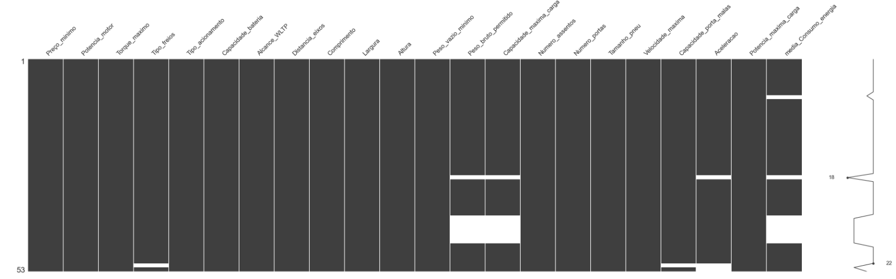
<br>
<br>
<br>

Gráfico-2, **"Resumo Estatísticos das Variáveis Categóricas"** 
<br>
<br>

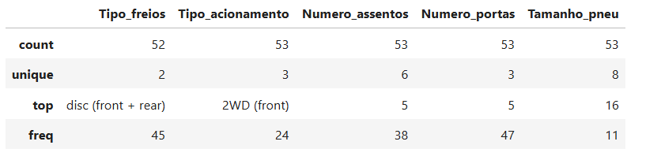
<br>
<br>
<br>

Gráfico-3, **"Resumo Estatísticos das Variáveis Numéricas"** 
<br>
<br>

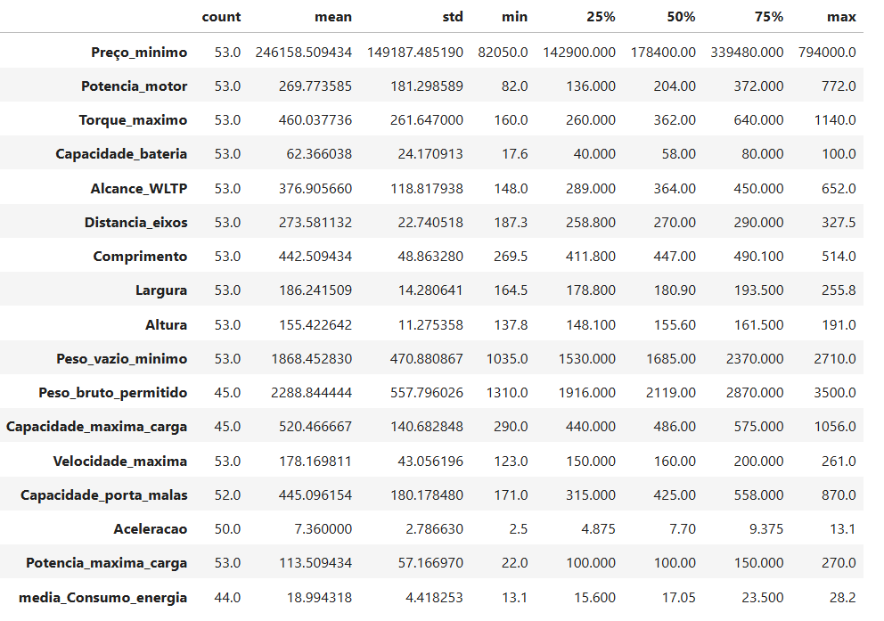
<br>

* **Insight:** Observamos que, em algumas variáveis, a média é maior que a mediana e os valores mínimos e máximos estão muito distantes. Isso sugere que a distribuição pode ser assimétrica positiva, indicando a presença de valores extremos na parte superior que "puxam" a média para cima. Ou seja, as variáveis não seguem uma distribuição normal e possivelmente contêm outliers.
<br>
<br>
<br>

### **5. Identificação e Tratamento dos Dados**

---
Nesta etapa, realizamos uma análise detalhada do dataset com o objetivo de identificar e corrigir inconsistências que pudessem comprometer a qualidade das análises e a performance dos modelos preditivos. Implementamos as seguintes abordagens:

*  **Remoção de Variáveis Irrelevantes:** Para otimizar e reduzir a dimensionalidade dos dados, simplificar os modelos e evitar possíveis multicolinearidades as variáveis 'Car full name', 'Make', 'Model' foram removidas.
*  **Renomeação de Variáveis:** Visando facilitar a compreensão e manipulação dos dados, todas as variáveis foram renomeadas para o idioma português.

* **Transformação de Variáveis para Categóricas:** Para viabilizar uma Análise Exploratória, as variáveis foram convertidas para o tipo 'categórica': 'Type of brakes' (Tipo de freios), 'Drive type' (Tipo de acionamento), 'Number of seats' (Número de assentos), 'Number of door' (Número de portas) e 'Tire size' (Tamanho do pneu). 
<br>
<br>

### **6. Análise Univariada**
---

Nesta etapa, vamos separar as variáveis categóricas das numéricas para análise exploratória.
<br>
<br>

Gráfico-4, **"Distribuição das Variáveis Categóricas"**
<br>

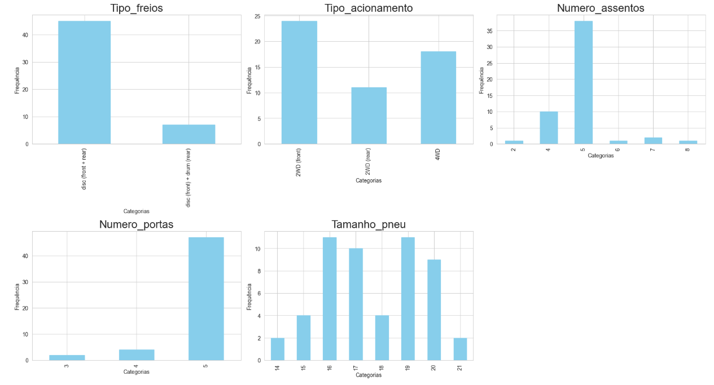
<br>
<br>

Gráfico-5, **"Distribuição das Variáveis Numéricas - Frequências"**
<br>

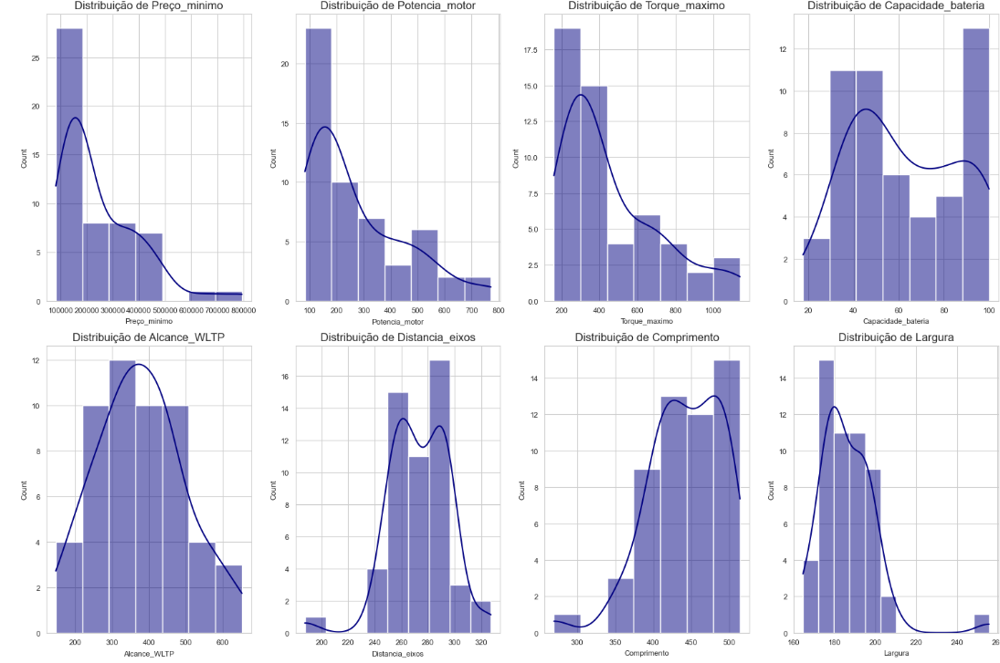
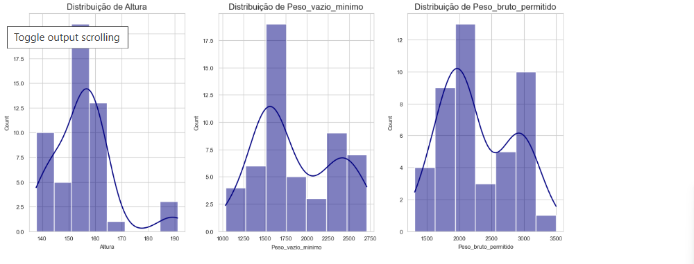

<br>
<br>

Gráfico-6, **"Distribuição das Variáveis Numéricas - Medidas de Tendência Central"**
<br>

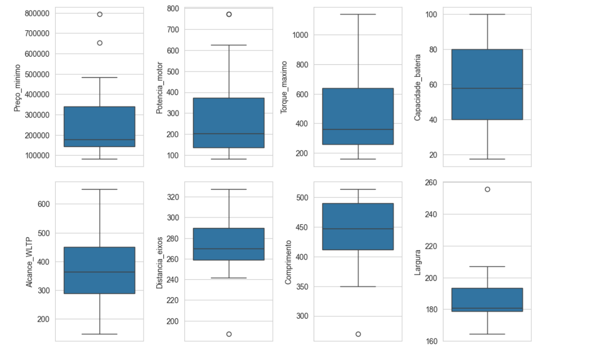
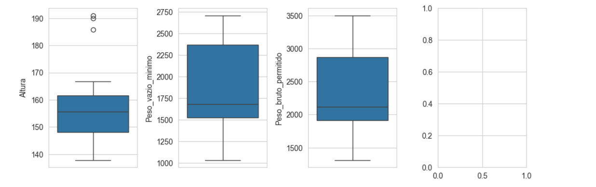


Pela distribuição do histograma e boxplot, é possível verificar indícios da presença de outliers nas seguintes variáveis:

* Preço_mínimo
* Potência_motor
* Distância_eixos
* Comprimento
* Largura
* Altura
* Capacidade_máxima_carga
* Potência_máxima_carga
 <br>
 <br>


### **7. Análise de Correlação**

---
<p>  Em probabilidade e estatística, a correlação, dependência ou associação refere-se a qualquer relação estatística entre duas variáveis.

<p> O estudo da correlação tem como objetivo determinar e quantificar o grau de relacionamento entre essas variáveis (por exemplo, X e Y).

O valor do coeficiente de correlação varia entre -1 e 1, onde o resultado obtido indica se a correlação é negativa ou positiva.
<br>
<br>

Gráfico-7, **"Matriz de Correlação"**
<br>
<br>
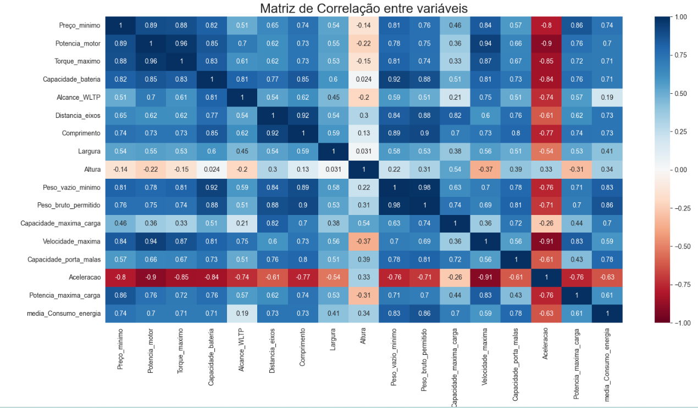
<br>
<br>

Gráfico-8, **"Interpretação da Matriz de Correlação"**
<br>
<br>
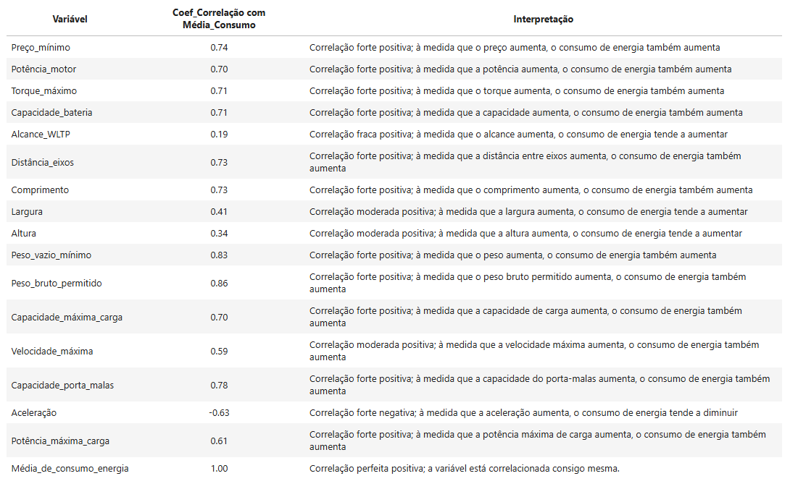
<br>
<br>

Gráfico-9, **"Correlação das Preditoras Numéricas com a Target"**
<br>
<br>
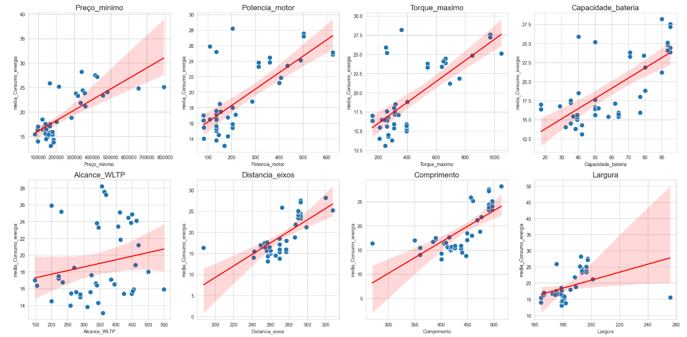
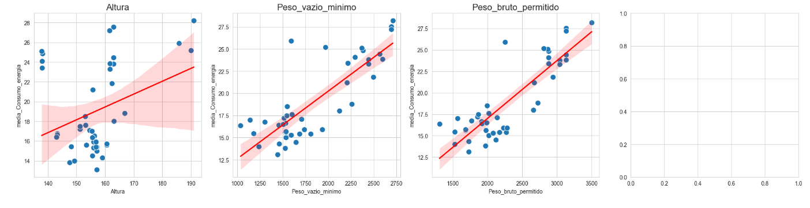
<br>
<br>

Gráficos, **"Correlação das Preditoras Categóricas com a Target"**
<br>
<br>

Gráfico-10, **"Tipo de Freios"**
<br>

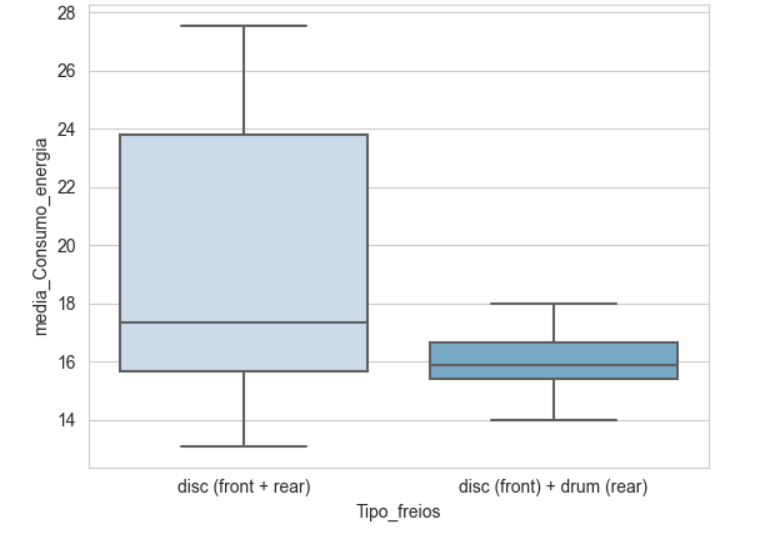
<br>
* **Tipo de Freios:** em termos de consumo de energia, os freios a disco combinados com freios (front + drum rear) são mais consistentes, enquanto os freios a disco em ambas as extremidades apresentam maior variabilidade no desempenho.

<br>
<br>

Gráfico-11, **"Tipo de Acionamento (Drive)"**
<br>


<br>
* **Tipo de Acionamento (Drive):** Veículos 2WD apresentam consumo de energia mais consistente em comparação com veículos 4WD, que variam mais e tendem a consumir mais energia.
<br>
<br>

Gráfico-12, **"Tipo de Assentos"**
<br>

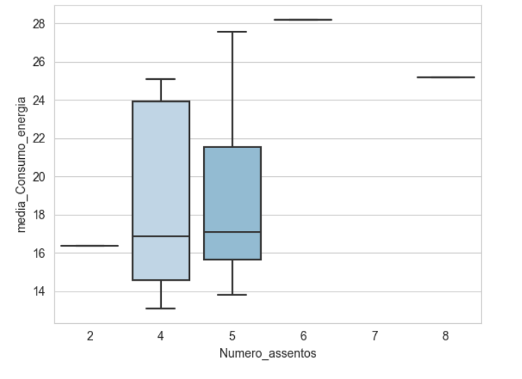
<br>

* **Numero de Assentos:** Veículos com 2 assentos têm consumo de energia baixo e consistente, enquanto veículos com 4 assentos apresentam maior variação no consumo, e veículos com 6 e 8 assentos tendem a ter o maior consumo médio (~25-28).
<br>
<br>

Gráfico-13, **"Tipo de Portas"**
<br>

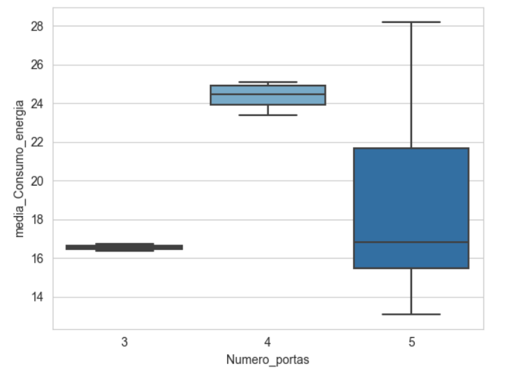
<br>

* **Numero de Portas:** Carros com 4 portas tendem a ter um consumo de energia mais alto e consistente, enquanto carros com 5 portas exibem a maior variabilidade no consumo.
<br>
<br>

Gráfico-14, **"Tipo de Pneu"**
<br>

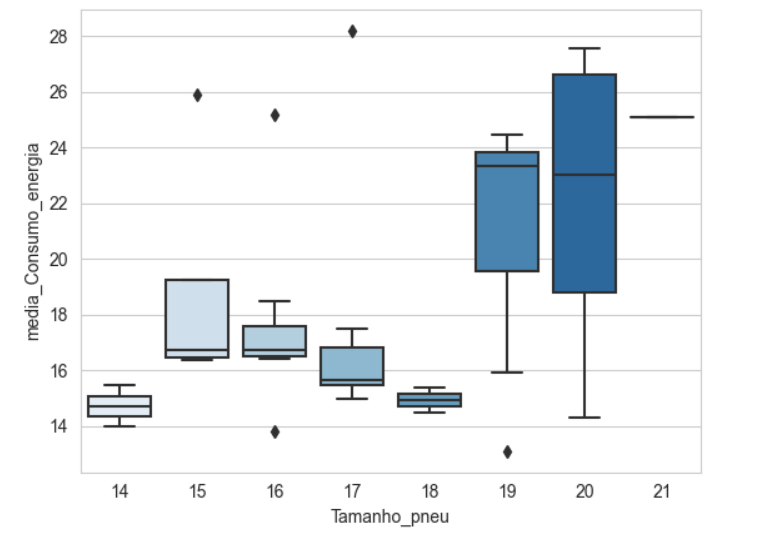
<br>

* **Tamanho do Pneu:** Pneus menores tendem a ter menor variabilidade e menor consumo de energia, enquanto pneus maiores exibem maior variabilidade e maior consumo.     
<br>
<br>


### **8. Desenvolvimento do Projeto**
---

###  ```8.1 Pré Processamento dos Dados ```

A preparação dos dados para modelagem envolve uma etapa de tratamento adicional. Antes desse tratamento, dividiremos o conjunto de dados em treino e teste. Essa estratégia é fundamental para evitar o "data leakage", ou vazamento de dados, durante o treinamento, assegurando que o modelo não tenha acesso às informações dos dados de teste, o que garante sua confiabilidade e capacidade de generalização em cenários reais.

O processo de **tratamento** envolve as seguintes etapas:

* **Divisão dos Dados:** Primeiro dividimos os dados em treino e teste (70% Treino e 30% Teste).
  
* **Tratar Valores Faltantes:** Usamos a moda para preencher valores ausentes em variáveis categóricas e a mediana para variáveis numéricas.
  
* **Label Enconder:** Aplicamos nas variáveis que possui categorias ordinais "ordenadas" como (Numero_assentos, Numero_portas, Tamanho_pneu).
  
* **One Hot enconder:** Aplicamos nas variáveis que não possui uma ordem natural como (Tipo_freios, Tipo_acionamento).
  
* **Tratar Outliers:** Aplicamos a técnica de Box-Cox para estabilizar a variância e aproximar dados de uma distribuição normal quando estes não seguem essa distribuição.
  
* **Padronizar:** O Standard Scaler transforma dados subtraindo a média e dividindo pelo desvio padrão, resultando em características com média 0 e desvio padrão 1, o que é útil para algoritmos sensíveis à escala.
 <br>
 <br>

###  ```8.2 Modelagem dos Dados ```

---

 O processo de **modelagem** envolve as seguintes etapas:
<br>


* **Seleção de Features:** Utilizamos o método RFE (Recursive Feature Elimination), um algoritmo de seleção de features que elimina aquelas que menos contribuem para a precisão do modelo.

* **Criação dos Modelos:** Foram implementados nove modelos, incluindo Ridge, Lasso, ElasticNet (técnicas de regularização); árvores de decisão (Decision Tree, Random Forest, Gradient Boosting); máquinas de vetores de suporte (SVR); método dos vizinhos mais próximos (KNeighbors); e modelo linear (Regressão Linear).

* **Validação Cruzada:** Para avaliar o desempenho dos modelos e obter uma estimativa mais robusta do R², foi utilizada validação cruzada com 5 folds (partições).

* **Métricas de Avaliação:**
<u>RMSE (Root Mean Squared Error)</u>, Raiz quadrada do erro médio quadrático, que mede a magnitude média dos erros entre as previsões do modelo e os valores reais, sendo mais sensível a outliers.
<br>

  <u>R² (Coeficiente de Determinação)</u>, Quantifica a proporção da variância na variável dependente que é explicada pelo modelo, variando de 0 a 1, onde valores próximos a 1 indicam um bom ajuste do modelo aos dados.
<br>
<br>

Gráfico-15, **"Modelo Base com Todas as Features"**
<br>

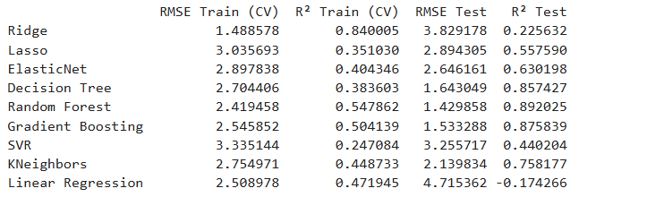
<br>
<br>
**Resultado:** O modelo Random Forest se destaca como o melhor, apresentando o menor erro <u>(RMSE de 1.429858)</u> e o maior <u>R² (0.892025)</u> no conjunto de teste.
 Apesar do bom desempenho dos modelos Gradient Boosting e Decision Tree, o Random Forest demonstra métricas ligeiramente superiores, indicando maior precisão e capacidade de explicar a variabilidade dos dados.
<br>
<br>

Gráfico-16, **"Modelo RFE com Seleção de Features"**
<br>

 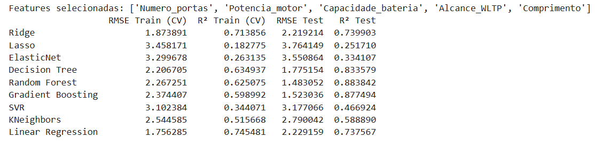
 <br>

**Resultado:** O modelo Random Forest se sobressai como a melhor opção, demonstrando o menor erro <u>(RMSE: 1.483052)</u> e o maior poder explicativo <u>(R²: 0.883842)</u> em comparação com o Gradient Boosting, que também apresenta bons resultados.
<br>
<br>
<br>

### **9. Conclusão do Projeto**
---

Para este projeto, optamos por utilizar o modelo de **Random Forest com todas as variáveis**, já que ele demonstrou um desempenho ligeiramente superior (RMSE de 1.42 e R² de 0.89) em comparação ao modelo com seleção de variáveis (RMSE de 1.48 e R² de 0.88). A escolha por utilizar todas as variáveis disponíveis foi feita devido à consistência dos resultados, garantindo que nenhuma informação relevante seja descartada.
<br>
<br>

Gráfico-17, **"Comparação entre Consumo Real e Previsto"**
<br>

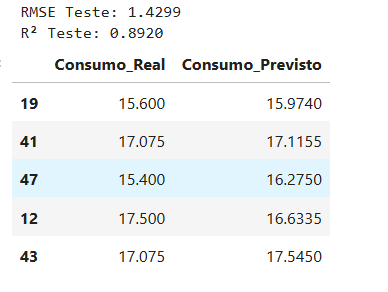

<br>
<br>

No entanto, reconhecemos que há oportunidades para melhorias e sugerimos os seguintes próximos passos:

* **Área de negócios:** para identificar quais features são mais importantes, evitando a eliminação de variáveis essenciais ao utilizar métodos de seleção e deixando a critério do algoritmo escolher as melhores features.
* **Ajustar os hiperparâmetros:** para alcançar um desempenho ainda melhor, explorando configurações que possam otimizar os resultados.
<br>

Com isso, concluímos este projeto e abrimos caminho para futuras melhorias e refinamentos.
<br>
<br>


### **10. Referências Bibliográficas**
---

 Pavan, Fernanda. (2024). **Prevendo o Consumo de Energia de Carros Elétricos.** Conclusão Acadêmica da Formação de Cientista de Dados. Data Science Academy, São Paulo, Brasil. Desenvolvido sob Mentoria dos Profissionais da Instituição. 

 Clique aqui para visitar a [Data Science Academy](https://www.datascienceacademy.com.br)

 <br>

 
  Hadasik, Bartłomiej; Kubiczek, Jakub (2021), “Dataset of electric passenger cars with their specifications”, Mendeley Data, V2, doi: 10.17632/tb9yrptydn.2

  Clique aqui para baixar o conjunto de dados [Dataset of electric passenger cars with their specifications](https://data.mendeley.com/datasets/tb9yrptydn/2)


